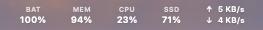
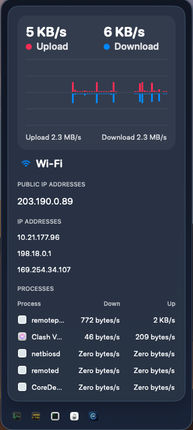
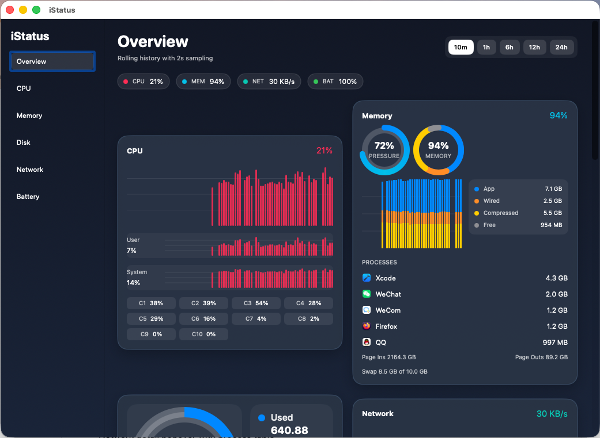
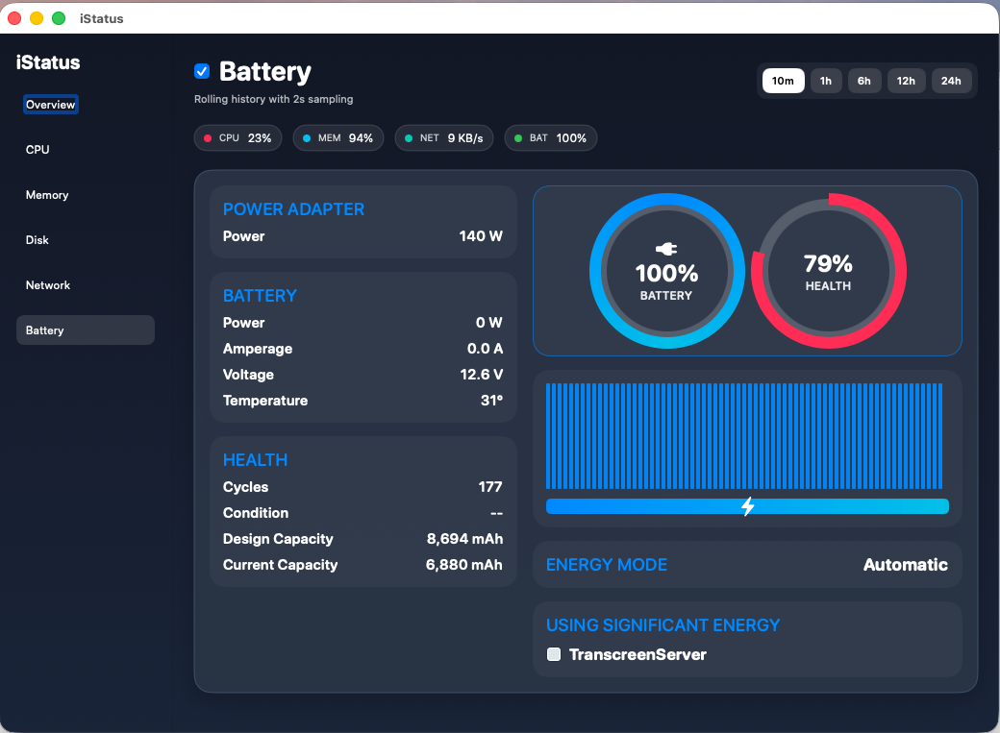

# iStatus

iStatus is a native macOS menu bar system monitor built with SwiftUI and AppKit. It is designed for people who want fast, glanceable system telemetry in the menu bar, plus a richer dashboard for deeper inspection when needed.

## Overview

iStatus continuously samples key macOS system metrics and surfaces them in three layers:

- Compact menu bar items for always-on monitoring
- Focused popover cards for each metric
- A full dashboard window with historical charts and detailed breakdowns

The current app covers:

- CPU usage
- Memory usage and memory composition
- Disk usage and disk throughput
- Network throughput, IP information, and top network-active processes
- Battery level, health, power, and significant energy usage

## Why iStatus

- Native macOS experience with SwiftUI and AppKit
- Fast 2-second rolling sampling loop
- Historical data persisted across launches
- Designed for quick scanning, not just raw numbers
- Menu bar first, dashboard when you need more detail

## Features

### Menu Bar Monitoring

- Enable or disable individual metric items
- Keep key system stats visible at a glance
- Open focused popovers directly from the menu bar

### Dashboard

- Overview screen for the most important metrics
- Dedicated sections for CPU, Memory, Disk, Network, and Battery
- Time-range switching for historical inspection
- Small, dense charts optimized for dark UI

### Process-Level Insights

- Top network-active processes
- Top disk-active processes
- Top memory-heavy processes
- Significant energy usage in the battery section

### Battery Details

- Charge percentage
- Battery health
- Power adapter state
- Voltage, amperage, temperature, and cycle count when available

## Screenshots

### Menu Bar

Compact always-on metrics in the macOS menu bar.

### Network Popover

Focused network detail with live throughput, IP addresses, and top processes.

### Dashboard Overview

The main dashboard combines historical charts with dense system summaries.

### Battery Panel

Battery health, power adapter state, capacity, and energy usage in one view.

## App Behavior

- The app launches as a menu bar app via `LSUIElement`
- Opening Dashboard or Menu Bar Settings temporarily shows the app in the Dock
- Closing those windows returns the app to menu bar mode

## Tech Stack

- Swift
- SwiftUI
- AppKit
- Xcode project-based macOS app
- No third-party dependencies

## Requirements

- macOS 14.0+
- Xcode 15+ recommended

## Getting Started

1. Open `iStatus.xcodeproj` in Xcode.
2. Select the `iStatus` target.
3. Build and run the app on macOS.

If icons or assets do not refresh immediately:

1. Quit the running app.
2. Use `Product > Clean Build Folder`.
3. Run the app again.

## Project Structure

- `iStatus/iStatusApp.swift`
  App entry point, status bar setup, window presentation, and Dock visibility behavior.

- `iStatus/DashboardView.swift`
  Main dashboard UI, detail popovers, process tables, battery panels, and shared formatting helpers.

- `iStatus/MenuBarView.swift`
  Menu bar settings UI, item definitions, and compact status strip rendering.

- `iStatus/MiniChartView.swift`
  Reusable compact chart primitives.

- `iStatus/MemoryStackChartView.swift`
  Specialized stacked memory visualization.

- `iStatus/RingGaugeView.swift`
  Ring-based gauge components used in the battery UI.

- `iStatus/Metrics/MetricsStore.swift`
  Central sampling loop, published metric state, persistence, and worker coordination.

- `iStatus/Metrics/MetricModels.swift`
  Shared data models for metrics, process stats, and battery details.

- `iStatus/Metrics/RingBuffer.swift`
  In-memory history storage for time-series samples.

- `iStatus/Metrics/Samplers/`
  System samplers for CPU, memory, disk, network, temperature, and battery.

- `iStatus/Resources/Assets.xcassets`
  App icon, in-app icon assets, and shared color assets.

- `docs/branding/`
  Logo concepts and icon source files used during design iteration.

## Sampling Model

`MetricsStore` drives a repeating background sampling loop.

- Default sample interval: 2 seconds
- Historical samples are retained in ring buffers
- Recent history is persisted across launches
- Views subscribe to published state and update live

## Notes On Data Availability

- Battery-specific details only appear on machines that expose that data
- Process tables intentionally show top items rather than exhaustive system process dumps

## Design Direction

The current product direction emphasizes:

- Dark, low-distraction surfaces
- Dense but readable system information
- Color accents that map to metric categories
- A menu bar first experience with an optional full dashboard

## Roadmap

Potential next steps:

- Custom alert thresholds
- Configurable sampling intervals
- Search and filtering for process tables
- Snapshot export
- Additional dashboard customization

## License

No license file is currently included. Add one before publishing the project for external reuse.
