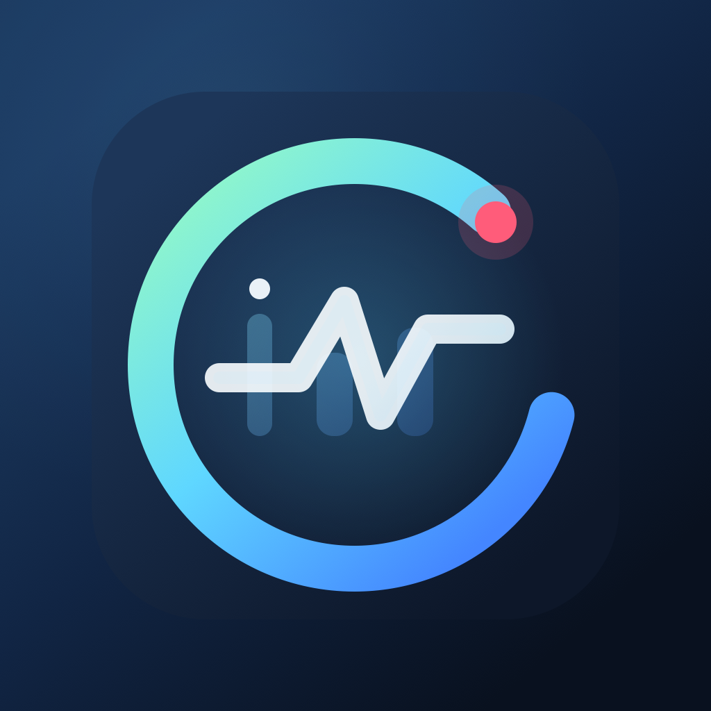
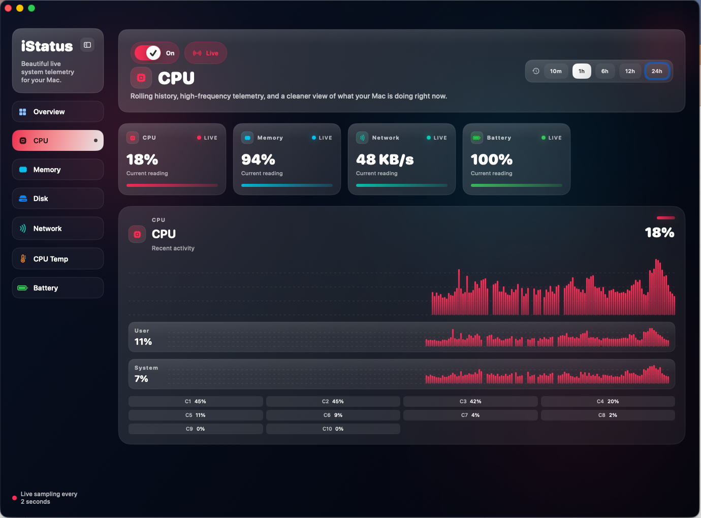
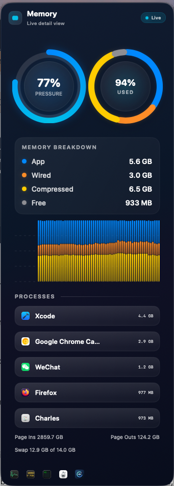
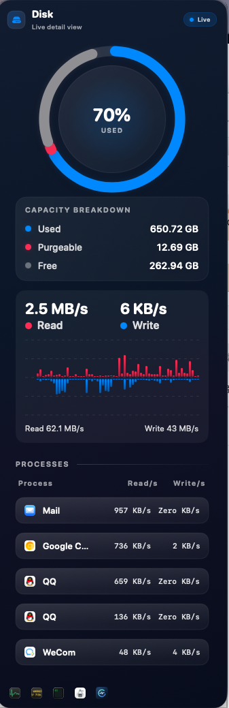

## Language / 语言

[English](README.md) | [简体中文](README.zh-CN.md)

# iStatus

  

iStatus 是一款基于 SwiftUI 和 AppKit 构建的原生 macOS 菜单栏系统监控工具，适合希望在菜单栏中快速查看关键系统状态，并在需要时进入完整 Dashboard 深入查看的用户。

## 项目概览

iStatus 会持续采样 macOS 的关键系统指标，并通过三层界面展示：

- 常驻菜单栏的紧凑指标项
- 针对单项指标的详情弹出卡片
- 带历史图表和详细信息的完整 Dashboard 窗口

当前应用覆盖的内容包括：

- CPU 使用率
- 内存使用情况与内存构成
- 磁盘使用率、可清理空间与磁盘吞吐
- 网络吞吐、IP 信息以及网络活跃进程
- 电池电量、健康度、电源状态与高能耗信息

## 为什么使用 iStatus

- 原生 macOS 使用体验，基于 SwiftUI 和 AppKit
- 默认 2 秒一次的高频采样循环
- 历史数据可跨应用启动保留
- 强调“快速扫读”，而不只是堆叠原始数字
- 以菜单栏为核心，必要时再进入完整 Dashboard

## 功能特性

### 菜单栏监控

- 可单独启用或关闭各个菜单栏指标项
- 让关键系统状态始终保持可见
- 提供可配置显示项的紧凑菜单栏状态条
- 可直接从菜单栏打开对应指标的详情弹窗
- 提供独立的菜单栏设置窗口，可预览状态条并调整显示项

### Dashboard

- 提供瀑布流式的总览页，便于快速查看核心指标
- 包含 CPU、内存、磁盘、网络和电池的独立分区
- 支持切换时间范围查看历史趋势
- 支持可收缩侧边栏
- 使用适合深色界面的紧凑型图表展示
- 补齐了统一的空状态与无数据状态
- 在较窄窗口下会自动切换为更紧凑的布局节奏

### 进程级信息

- 网络活跃进程排行
- 磁盘活跃进程排行
- 内存占用较高进程排行
- 电池页面中的显著能耗应用

### 电池详情

- 当前电量百分比
- 电池健康度
- 电源适配器状态
- 可用时显示电压、电流、温度与循环次数

### 指标详情弹窗

- CPU、内存、磁盘、网络和电池弹窗已统一为同一套标题与视觉结构
- 针对菜单栏场景做了更紧凑的环图、图表和进程列表布局
- 主窗口与弹窗之间复用了统一的图表和卡片风格
- 针对不同指标设置了更合适的弹窗宽度，便于菜单栏场景阅读

## 截图

下面这些截图已经对应当前版本 UI。

### 菜单栏

macOS 菜单栏中的常驻紧凑指标展示，建议更新为当前较大的状态条字体版本。

### 指标弹窗

当前样式的详情弹窗，体现统一标题栏、单层结构和更新后的进程列表。

### Dashboard 总览

主 Dashboard 将历史图表与高密度系统信息整合到同一界面中，并采用新的总览瀑布流布局。

### 内存或磁盘详情

当前电池详情面板。

### 菜单栏设置

独立的菜单栏设置窗口，包括状态条预览和显示项开关。

### 内存弹窗

当前紧凑版双环内存弹窗和新版 breakdown 面板。

### 磁盘弹窗

当前单环磁盘弹窗和参考 Memory 风格的容量 breakdown。

## 应用行为

- 应用通过 `LSUIElement` 以菜单栏应用方式启动
- 打开 Dashboard 或菜单栏设置时，应用会临时显示在 Dock 中
- 关闭这些窗口后，会恢复为仅菜单栏模式

## 技术栈

- Swift
- SwiftUI
- AppKit
- 基于 Xcode 工程的 macOS 应用
- 无第三方依赖

## 运行要求

- macOS 14.0+
- 建议使用 Xcode 15+

## 快速开始

1. 使用 Xcode 打开 `iStatus.xcodeproj`。
2. 选择 `iStatus` target。
3. 在 macOS 上构建并运行应用。

如果图标或资源没有立即刷新：

1. 退出正在运行的应用。
2. 在 Xcode 中执行 `Product > Clean Build Folder`。
3. 再次运行应用。

## 项目结构

- `iStatus/iStatusApp.swift`
  应用入口、状态栏初始化、窗口展示以及 Dock 显示逻辑。

- `iStatus/StatusBarController.swift`
  承接 AppKit 菜单栏宿主视图，并负责菜单展示协调。

- `iStatus/DashboardView.swift`
  Dashboard 主界面、Overview 瀑布流布局、详情弹窗、进程表格、指标卡片以及共享格式化逻辑。

- `iStatus/MenuBarView.swift`
  菜单栏首页、菜单栏设置界面、指标项定义以及紧凑状态条渲染。

- `iStatus/MiniChartView.swift`
  可复用的紧凑型图表基础组件。

- `iStatus/MemoryStackChartView.swift`
  用于内存场景的堆叠图可视化组件。

- `iStatus/RingGaugeView.swift`
  多个摘要视图中复用的环形仪表组件。

- `iStatus/Metrics/MetricsStore.swift`
  中央采样循环、指标状态发布、持久化与后台协调逻辑。

- `iStatus/Metrics/MetricModels.swift`
  指标、进程状态和电池详情所使用的共享数据模型。

- `iStatus/Metrics/RingBuffer.swift`
  用于保存时间序列样本的内存环形缓冲区。

- `iStatus/Metrics/Samplers/`
  CPU、内存、磁盘、网络和电池等系统采样器。

- `iStatus/Helper/`
  用于需要更高权限的遥测能力的辅助进程接入与管理。

- `iStatus/Shared/`
  主应用与辅助进程之间共享的数据模型和 XPC 协议定义。

- `iStatus/iStatusHelper/`
  承载特权采样逻辑的 helper 可执行目标。

- `iStatus/Resources/Assets.xcassets`
  应用图标、应用内品牌图和共享颜色资源。

- `docs/branding/`
  设计迭代过程中使用的 Logo 概念稿和图标源文件。

## 采样模型

`MetricsStore` 负责驱动重复执行的后台采样循环。

- 默认采样间隔为 2 秒
- 历史样本保存在环形缓冲区中
- 最近历史数据会跨应用启动持久化
- 视图通过订阅发布状态实现实时刷新

## 数据可用性说明

- 电池相关详细信息仅会在对应 Mac 提供这些数据时显示
- 部分需要更高权限的遥测能力依赖 helper 及机器权限状态，不同设备上表现可能不同
- 进程列表有意只展示最重要的顶部条目，而不是完整系统进程清单
- 磁盘可清理空间与可用容量基于 macOS 卷资源值，具体表现会受文件系统结构影响

## 设计方向

当前产品设计强调：

- 深色、低干扰的界面表面
- 高密度但依然易读的系统信息
- 与不同指标类型对应的颜色强调
- 以菜单栏为核心，完整 Dashboard 作为补充

## 路线图

后续可能的方向包括：

- 自定义告警阈值
- 可配置的采样间隔
- 进程表的搜索与筛选
- 快照导出
- 更多 Dashboard 自定义能力
- 在采集链路稳定后补上 CPU 温度、热压力和风扇遥测

## 许可证

本项目采用 MIT License。详细内容请查看 [LICENSE](LICENSE) 文件。
